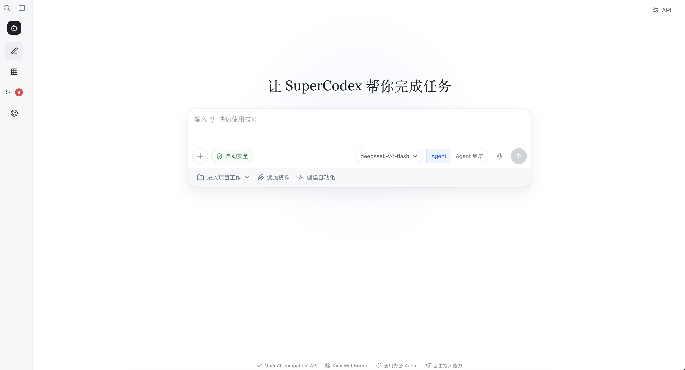

# SuperCodex

SuperCodex 是一个本地运行的通用办公 Agent。它提供类似 Codex / Kimi Work 的任务式交互体验，但模型 API 可以自由接入，只要兼容 OpenAI Chat Completions 接口即可。

项目当前定位不是单纯 coding agent，而是面向办公、研究、文件处理、网页任务、本地项目修改和自动化流程的通用 Agent 工作台。

## 界面预览



## 当前能力边界

SuperCodex 当前适合本地个人工作台和小团队内测，不建议直接暴露到公网。它默认信任本机用户，并通过工作区路径限制和命令拦截降低破坏性操作风险。

### 稳定能力

- OpenAI-compatible API 接入，支持 DeepSeek、OpenAI、兼容网关或自建模型服务。
- Agent 自主判断是否调用工具，后端不再用固定规则决定工具开关。
- 默认最多 24 轮工具调用，可通过环境变量调整，适合较长任务链同时避免异常循环。
- 流式执行过程展示，前端可实时看到任务步骤、工具调用和工具结果。
- Agent 上下文会保留摘要和最近消息窗口，并对工具结果做预算截断，降低长任务 token 消耗。
- 本地项目加载，可让 Agent 读取、搜索、修改项目文件并运行测试。
- 文件和图片附件上传，支持通过加号菜单或粘贴添加。
- 图片处理能力，支持缩放、裁剪、旋转、灰度、模糊、锐化、翻转和格式转换。
- 网络搜索能力，基于 `open-websearch`。
- Kimi WebBridge 集成，可连接真实浏览器执行网页任务。
- 自动安全护栏：常规工具调用默认自动执行，删除、强制清理、仓库重置、格式化、提权等危险命令会被后端直接拦截。
- 工具输出清洗，避免浏览器任务把 HTML / DOM / 原始 JSON 直接输出给用户。
- 任务步骤卡片和产物卡片，让执行过程和交付物更接近真实办公工作流。

### 实验能力

- 自然语言创建自动化任务，目前支持每天固定时间、固定小时间隔和少量办公语义。
- Kimi WebBridge 浏览器控制，目前只开放状态检查、标签页、快照、导航等低风险动作。
- 技能入口目前用于表达产品方向，邮件、团队消息、文件连接仍需要真实连接器补齐。

## 技术栈

- 前端：React 19 + Vite 7 + TypeScript
- 后端：Express 5 + TypeScript
- 图像处理：Sharp
- 文件上传：Multer
- 网络搜索：open-websearch
- 浏览器控制：Kimi WebBridge
- 状态存储：本地 `.supercodex/state.json` 索引 + `.supercodex/conversations/` 会话目录

## 项目结构

```text
SuperCodex/
├── server/
│   └── index.ts              # Express API、Agent Loop、工具注册
├── src/
│   ├── App.tsx               # 主前端界面与交互逻辑
│   ├── App.css               # 界面样式
│   └── main.tsx              # React 入口
├── server/core/              # 可测试的安全、路径和文本基础逻辑
├── server/automation/        # 自动化时间解析和调度规则
├── .env.example              # 环境变量示例
├── package.json
├── vite.config.ts
└── README.md
```

`.supercodex/` 是运行时目录，会在本地自动生成，用于保存会话、上传文件、自动化结果和索引状态。它包含个人数据，默认不进入 git。

## 快速开始

### 1. 安装依赖

```bash
npm install
```

### 2. 配置环境变量

复制示例配置：

```bash
cp .env.example .env
```

编辑 `.env`：

```env
API_BASE_URL=https://api.openai.com/v1
API_KEY=sk-your-key
API_MODEL=gpt-4.1
PORT=8787
MAX_AGENT_TURNS=200
MAX_OUTPUT_TOKENS=1600
RECENT_CONTEXT_MESSAGES=24
MAX_CONTEXT_TOOL_CHARS=600000
MAX_CONTEXT_MESSAGE_CHARS=10000
MAX_TOOL_RESULT_CHARS=12000
```

如果使用 DeepSeek，可配置为：

```env
API_BASE_URL=https://api.deepseek.com
API_KEY=sk-your-deepseek-key
API_MODEL=deepseek-chat
PORT=8787
MAX_AGENT_TURNS=200
MAX_OUTPUT_TOKENS=1600
```

不要把真实 API Key 提交到仓库。

### 3. 启动开发环境

```bash
npm run dev
```

默认服务：

- 前端：`http://localhost:5173`
- 后端：`http://localhost:8787`

如果你手动指定 Vite 端口，例如：

```bash
npm run dev:client -- --host 127.0.0.1 --port 5174
```

则访问：

```text
http://127.0.0.1:5174/
```

### 4. 单独启动前后端

```bash
npm run dev:server
npm run dev:client
```

### 5. 构建

```bash
npm run build
```

### 6. 测试

```bash
npm test
```

## 后端 API

### 应用状态

- `GET /api/health`：健康检查和工具列表
- `GET /api/app`：读取应用状态
- `GET /api/settings`：读取模型配置
- `PUT /api/settings`：更新模型配置

### 项目与会话

- `POST /api/projects`：创建项目
- `POST /api/workspaces/load`：加载本地项目目录
- `GET /api/projects/:id/tree`：读取项目文件树
- `POST /api/conversations`：创建会话
- `GET /api/conversations/:id/messages`：读取会话消息
- `POST /api/conversations/:id/messages`：发送消息，支持 SSE 流式事件

### 附件

- `POST /api/conversations/:id/attachments`：上传附件
- `GET /api/attachments/:id/content`：读取附件内容

### 工具与能力

- `GET /api/tools`：查看可用工具
- `GET /api/web/search`：网页搜索
- `GET /api/webbridge/status`：WebBridge 状态
- `POST /api/tools/run-command`：执行安全命令

### 自动化

- `GET /api/automations`
- `POST /api/automations`：创建定时任务，支持 `instruction` 自然语言，例如“每天早上9点返回新闻”“每2h提醒喝水和休息”。
- `PATCH /api/automations/:id`：更新标题、任务内容、时间规则或启停状态。
- `DELETE /api/automations/:id`

当前自动化支持：

- 每天固定时间：`每天 09:00`、`每天早上9点`、`11:30返回早盘情况`
- 固定间隔：`每2h`、`每2小时`
- 常用办公语义：`下班前完成今日工作的总结` 会解析为 `每天 17:30`

到点后，后端调度器会自动调用 Agent 执行任务，并把结果写入对应的“自动化：...”会话。自动化页会显示下次运行时间、最近状态和跳转入口。

每次自动化执行成功后，系统会生成一份 Markdown 结果文档附件，用户可以在定时任务详情页直接打开。定时任务的启停、删除、查看执行会话和打开结果文档都集中在详情页；创建新任务通过“创建自动化”对话框完成。

## 产物文件区域

每个本地项目工作区都会使用 `supercodex-files/` 作为默认产物目录。Agent 通过 `write_file`、图片处理、自动化结果或未指定 `cwd` 的脚本命令生成文件时，默认会把文件、脚本和中间结果放到这个目录。

如果用户明确指定了输出路径，例如 `docs/report.md` 或某个工作区内的绝对路径，SuperCodex 会按指定路径写入；否则裸文件名如 `report.md`、`chart.html`、`draft.py` 都会落到 `supercodex-files/`。产物卡片会直接链接到对应文件，前端点击即可打开。

## Agent 工具清单

当前内置工具：

| 工具 | 作用 |
| --- | --- |
| `list_directory` | 列出当前工作区目录 |
| `read_file` | 读取文本文件 |
| `write_file` | 写入或创建文本文件 |
| `run_command` | 执行安全 shell 命令 |
| `search_files` | 使用 ripgrep 搜索项目文件 |
| `replace_in_file` | 精确替换文件内容 |
| `run_tests` | 运行测试、lint 或构建命令 |
| `list_attachments` | 列出当前会话附件 |
| `read_attachment` | 读取文本附件或返回附件元信息 |
| `transform_image` | 修改图片并生成新附件 |
| `fetch_url` | 抓取网页并提取可读内容 |
| `search_web` | 调用 open-websearch 搜索网页 |
| `webbridge_status` | 检查 Kimi WebBridge 状态 |
| `webbridge_command` | 通过 Kimi WebBridge 控制真实浏览器 |

### 自动安全策略

SuperCodex 默认完全自动执行 Agent 选择的工具，不要求用户在任务中途逐次确认。为了避免破坏性操作，后端会自动拦截删除、移入废纸篓、`find -delete`、`git clean`、`git reset --hard`、格式化磁盘、写入块设备、提权、关机重启等危险命令。文件工具仍限制在当前工作区内运行。

安全策略位于 `server/core/security.ts`，路径限制位于 `server/core/paths.ts`。这些规则有最小测试覆盖，方便开源后审查和扩展。

## 流式执行事件

发送消息时可传入：

```json
{
  "content": "帮我分析这个网页",
  "stream": true
}
```

后端通过 SSE 返回：

| 事件 | 说明 |
| --- | --- |
| `step` | Agent 当前执行步骤 |
| `assistant_tool_call` | 模型请求调用工具 |
| `tool_result` | 工具执行完成 |
| `final` | 最终回复和完整会话 |
| `error` | 执行失败 |

前端会把这些事件渲染为任务步骤卡片，并默认折叠原始工具结果。

## 前端交互说明

当前界面包括：

- 左侧工作台导航：新建任务、搜索、技能、定时任务、WebBridge、历史记录。
- 可折叠侧边栏：左上角按钮控制展开和收起。
- 底部任务输入框：`Enter` 发送，`Shift + Enter` 换行。
- 加号菜单：上传文件或图片、选择本地项目、添加网页链接、粘贴剪贴板文本。
- 任务步骤卡片：展示 Agent 正在做什么。
- 产物卡片：展示附件、图片处理结果和写入文件结果。
- 富文本回复：将 Markdown 标题、列表、表格、重点文本渲染为自然阅读排版。

## 本地项目工作流

1. 点击底部上下文栏的“进入项目工作”，或从加号菜单选择“选择本地项目”。
2. 输入本地项目路径。
3. Agent 会把该目录作为当前工作区。
4. 文件、搜索、代码修改和测试工具会默认在该目录内运行。

后端会限制文件工具只能访问当前工作区内的路径，避免越界读写。

## 会话持久化

SuperCodex 会为每个对话维护一个独立目录：

```text
.supercodex/conversations/<对话标题>-<短ID>/
├── overview.md       # 对话时间、消息数、总结、上传数据和产物索引
├── messages.json     # 完整对话内容和工具结果
├── uploads/          # 用户上传的数据
└── artifacts/        # Agent 产生的文件、图片、报告等产物
```

`state.json` 继续作为轻量索引，便于快速加载项目、历史记录、自动化和附件映射；完整对话和产物则按会话目录落盘，避免长期使用后所有数据混在一个文件里。新对话标题会优先由模型进行短标题分类生成，无模型配置时使用本地规则兜底。

## 文件与图片能力

支持通过两种方式添加附件：

- 点击加号菜单上传
- 在输入框中直接粘贴文件或图片

图片处理能力由 Sharp 提供，支持：

- resize
- crop
- rotate
- grayscale
- blur
- sharpen
- flip / flop
- png / jpeg / webp 格式转换

生成后的图片会作为新附件保存，并在前端显示为产物卡片。

## WebBridge

SuperCodex 可通过 Kimi WebBridge 控制真实浏览器。

安装方式：

```bash
curl -fsSL https://cdn.kimi.com/webbridge/install.sh | bash
```

安装后需要确认：

1. daemon 正在运行。
2. 浏览器扩展已启用。
3. `/api/webbridge/status` 返回 connected 状态。

WebBridge 适用于需要真实登录态、真实网页交互或截图的任务。

## 安全策略

SuperCodex 是本地 Agent，具备文件读写和命令执行能力。当前安全策略包括：

- 文件路径限制在当前工作区内。
- 命令执行存在黑名单过滤。
- 默认阻止高风险命令，例如：
  - `rm -rf`
  - `git reset --hard`
  - `git clean -fd`
  - `sudo`
  - `mkfs`
  - `dd if=`
- 网页抓取会清洗 HTML / DOM，避免原始网页源码直接进入最终回复。

注意：当前项目还不是强沙箱环境。如果要在生产或多人环境使用，建议增加容器隔离、权限确认和审计日志。

## 数据存储

本地状态存储在：

```text
.supercodex/state.json
```

附件存储在：

```text
.supercodex/uploads/
```

这些数据默认不应提交到 Git。

## 常见问题

### 前端显示“无法连接后端”

检查后端是否运行：

```bash
curl http://localhost:8787/api/health
```

如果无法连接，启动后端：

```bash
npm run dev:server
```

### 端口不一致

Vite 默认配置代理到：

```text
http://localhost:8787
```

如果修改后端端口，需要同步修改 `.env` 和 `vite.config.ts`。

### 模型不调用工具

当前工具调用由模型自行判断。请确认：

- API 模型支持 OpenAI tools / function calling。
- 后端 `/api/health` 能看到工具列表。
- 请求中没有关闭工具能力。

### open-websearch 不可用

确认依赖已安装：

```bash
npm install
```

并检查：

```bash
npx open-websearch --help
```

## 开发建议

- 优先保持工具结果结构化，避免把原始 HTML、DOM、超长日志直接暴露给模型和用户。
- 新增工具时同时考虑：
  - 工具定义
  - 参数边界
  - 安全策略
  - 前端步骤展示摘要
  - 产物提取逻辑
- 涉及文件写入、命令执行、网页自动化时，应增加更细粒度权限确认。

## 当前限制

- 没有真正的 Docker / VM 沙箱隔离。
- 自动化任务目前是基础数据结构，尚未实现完整调度器。
- 邮件、日历、云文档等办公连接仍是技能入口，尚未接入完整第三方 OAuth。
- WebBridge 依赖本机 daemon 和浏览器扩展状态。
- 多 Agent 并行尚未实现。

## License

当前项目为私有项目，暂未声明开源许可证。
