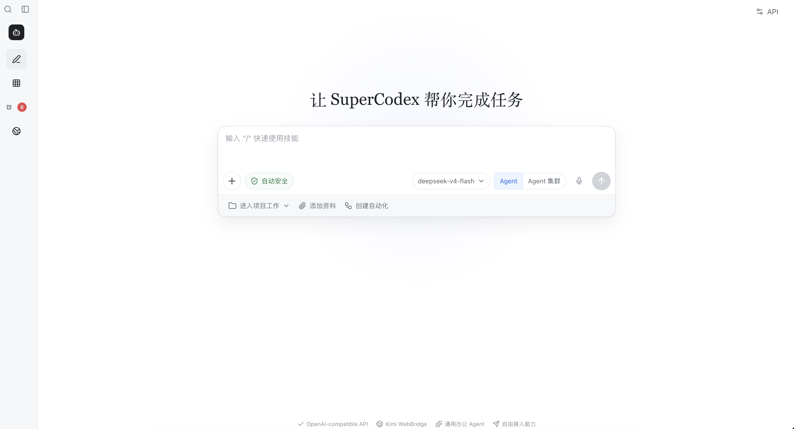

# SuperCodex

SuperCodex 是一个本地运行的通用办公 Agent。它提供类似 Codex / Kimi Work 的任务式交互体验，但模型 API 可以自由接入，只要兼容 OpenAI Chat Completions 接口即可。

项目当前定位不是单纯 coding agent，而是面向办公、研究、文件处理、网页任务、本地项目修改和自动化流程的通用 Agent 工作台。

## 界面预览



## 当前能力边界

SuperCodex 当前适合本地个人工作台和小团队内测，不建议直接暴露到公网。它默认信任本机用户，并通过工作区路径限制和命令拦截降低破坏性操作风险。

### 稳定能力

- OpenAI-compatible API 接入，支持 DeepSeek、OpenAI、兼容网关或自建模型服务。
- Agent 自主判断是否调用工具，后端不再用固定规则决定工具开关。
- 默认最多 24 轮工具调用，可通过环境变量调整，适合较长任务链同时避免异常循环。
- 流式执行过程展示，前端可实时看到任务步骤、工具调用和工具结果。
- Agent 上下文会保留摘要和最近消息窗口，并对工具结果做预算截断，降低长任务 token 消耗。
- 本地项目加载，可让 Agent 读取、搜索、修改项目文件并运行测试。
- 文件和图片附件上传，支持通过加号菜单或粘贴添加。
- PDF、Word、PPTX、CSV/XLSX 附件会进入专用解析工具，支持一句话触发摘要、审查、表格分析和演示文稿检查。
- 图片处理能力，支持缩放、裁剪、旋转、灰度、模糊、锐化、翻转和格式转换。
- 网络搜索能力，基于 `open-websearch`。
- Kimi WebBridge 集成，可连接真实浏览器执行网页任务。
- Google 日历主日历只读连接：支持桌面应用 OAuth 授权、PKCE、令牌刷新、断开与撤销，并可读取未来日程供界面或 Agent 使用。
- 长期目标可选择监控已连接的 Google 日历：创建步骤时记录未来七天已有事件，此后每五分钟轮询近期新增或更新，并在入队时持久保存已处理版本，避免重复执行。
- 自动安全护栏：常规工具调用默认自动执行，删除、强制清理、仓库重置、格式化、提权等危险命令会被后端直接拦截。
- 工具输出清洗，避免浏览器任务把 HTML / DOM / 原始 JSON 直接输出给用户。
- 任务步骤卡片和产物卡片，让执行过程和交付物更接近真实办公工作流。
- 长期目标工作区：保存目标、拆解步骤、按固定时间重复执行，并查看活动记录。
- 用户可在目标中用箭头重排未完成步骤；已完成、排队和运行中的步骤保留原位置，计划版本防止过期页面覆盖新顺序。
- 完成最后一个非定期目标步骤后，可生成复盘和后续步骤建议；建议需由用户逐条接纳才会进入计划。
- 每个目标可保存多份可编辑文稿，用于跨步骤持续维护报告或清单；用户直接编辑，Agent 可自动更新。版本号防止过期编辑覆盖新内容。
- 长期目标步骤在后端执行，关闭浏览器不会中断；重启后，尚未开始工具操作的规划步骤会自动恢复，进入工具阶段的步骤需人工核对后再运行。
- 长期目标步骤可监控公开 GitHub 仓库的 Release；新版本会触发一次后台执行，已处理的版本 ID 会持久保存。
- 定时任务在服务重启后会把未完成的运行标为中断，跳过可能已产生副作用的那一次运行。
- 普通会话、长期目标和定时任务中的写文件、命令与外部工具操作默认自动放行；执行前记录参数，执行后记录结果。可显式设置 `APPROVAL_MODE=manual` 恢复逐次审批。
- 用户可维护跨会话或指定目标的记忆，随时编辑或删除；可逐条设置为相关任务使用、始终提供给 Agent 或仅本地保存。对话中的长期偏好先作为带原话来源的候选项，确认后才按任务相关性进入 Agent 上下文。
- 提醒收件箱汇总需要处理的事项、目标进展和定时任务结果；可标记已读，选择关闭、仅重要或所有进展，浏览器桌面通知需用户主动启用。
- 同一轮到达的后台事件合并为一条桌面通知，桌面通知最短间隔为 1 分钟；所有事件仍保留在提醒收件箱。

### 实验能力

- 自然语言创建自动化任务，目前支持每天固定时间、固定小时间隔和少量办公语义。
- Kimi WebBridge 浏览器控制：可检查状态、标签页、快照和导航；填写或点击页面元素默认自动执行并留档，执行前会再次核对实际页面与元素。
- Google 日历连接器需要用户自行创建 Google Cloud 桌面应用 OAuth 客户端并完成真实账号授权；邮件、团队消息、云文件连接仍待接入。

## 技术栈

- 前端：React 19 + Vite 7 + TypeScript
- 后端：Express 5 + TypeScript
- 图像处理：Sharp
- 文件上传：Multer
- 网络搜索：open-websearch
- 浏览器控制：Kimi WebBridge
- 状态存储：本地 `.supercodex/state.sqlite` + `.supercodex/conversations/` 会话导出目录

## 项目结构

```text
SuperCodex/
├── server/
│   └── index.ts              # Express API、Agent Loop、工具注册
├── src/
│   ├── App.tsx               # 主前端界面与交互逻辑
│   ├── App.css               # 界面样式
│   └── main.tsx              # React 入口
├── server/core/              # 可测试的安全、路径和文本基础逻辑
├── server/automation/        # 自动化时间解析和调度规则
├── .env.example              # 环境变量示例
├── package.json
├── vite.config.ts
└── README.md
```

`.supercodex/` 是运行时目录，会在本地自动生成，用于保存会话、上传文件、自动化结果和索引状态。它包含个人数据，默认不进入 git。

Google 日历授权文件单独保存在 `~/.supercodex/connectors/<工作区标识>/google-calendar.json`，文件权限为 `0600`，不会写入项目内的 SQLite。当前 Agent 仍可通过本机命令接触用户文件系统，尚无独立进程沙箱或系统钥匙串隔离。

## 快速开始

### 1. 安装依赖

需要 Node.js 24 或更新版本；当前开发环境使用 Node.js 26。持久状态使用 Node 内置 SQLite。

```bash
npm install
```

### 2. 配置环境变量

复制示例配置：

```bash
cp .env.example .env
```

编辑 `.env`：

```env
API_BASE_URL=https://api.openai.com/v1
API_KEY=sk-your-key
API_MODEL=gpt-4.1
PORT=8787
MAX_AGENT_TURNS=200
MAX_OUTPUT_TOKENS=1600
RECENT_CONTEXT_MESSAGES=24
MAX_CONTEXT_TOOL_CHARS=600000
MAX_CONTEXT_MESSAGE_CHARS=10000
MAX_TOOL_RESULT_CHARS=12000
MAX_CONCURRENT_GOAL_TASKS=2
# 可选，也可在“日历连接”界面填写
GOOGLE_OAUTH_CLIENT_ID=your-desktop-client.apps.googleusercontent.com
GOOGLE_OAUTH_CLIENT_SECRET=
```

如果使用 DeepSeek，可配置为：

```env
API_BASE_URL=https://api.deepseek.com
API_KEY=sk-your-deepseek-key
API_MODEL=deepseek-chat
PORT=8787
MAX_AGENT_TURNS=200
MAX_OUTPUT_TOKENS=1600
```

不要把真实 API Key 提交到仓库。

### 3. 启动开发环境

```bash
npm run dev
```

默认服务：

- 前端：`http://localhost:5173`
- 后端：`http://localhost:8787`

如果你手动指定 Vite 端口，例如：

```bash
npm run dev:client -- --host 127.0.0.1 --port 5174
```

则访问：

```text
http://127.0.0.1:5174/
```

### 4. 单独启动前后端

```bash
npm run dev:server
npm run dev:client
```

### 5. 构建

```bash
npm run build
```

### 6. 测试

```bash
npm test
```

## 后端 API

### 应用状态

- `GET /api/health`：健康检查和工具列表
- `GET /api/app`：读取应用状态
- `GET /api/settings`：读取模型配置
- `PUT /api/settings`：更新模型配置

### 项目与会话

- `POST /api/projects`：创建项目
- `POST /api/workspaces/load`：加载本地项目目录
- `GET /api/projects/:id/tree`：读取项目文件树
- `POST /api/conversations`：创建会话
- `GET /api/conversations/:id/messages`：读取会话消息
- `POST /api/conversations/:id/messages`：发送消息，支持 SSE 流式事件

### 附件

- `POST /api/conversations/:id/attachments`：上传附件
- `GET /api/attachments/:id/content`：读取附件内容

### 工具与能力

- `GET /api/tools`：查看可用工具
- `GET /api/web/search`：网页搜索
- `GET /api/webbridge/status`：WebBridge 状态
- `POST /api/tools/run-command`：执行安全命令

### 自动化

- `GET /api/automations`
- `POST /api/automations`：创建定时任务，支持 `instruction` 自然语言，例如“每天早上9点返回新闻”“每2h提醒喝水和休息”。
- `PATCH /api/automations/:id`：更新标题、任务内容、时间规则或启停状态。
- `DELETE /api/automations/:id`

### 长期目标与执行记录

- `GET /api/goals`、`POST /api/goals`：查看和创建长期目标。
- `PATCH /api/goals/:id`：暂停、恢复或完成目标。
- `POST /api/goals/:id/plan`：使用已配置模型生成执行步骤。
- `POST /api/goals/:id/reviews`：复盘最近完成的步骤；相同执行结果的复盘会复用。
- `POST /api/goals/:id/reviews/:reviewId/suggestions/:suggestionId/decision`：逐条接纳或忽略后续建议。
- `POST /api/goals/:id/tasks`：手动添加步骤，可设置每天固定时间、每 N 小时、工作区文件变化或公开 GitHub 仓库新 Release 触发。
- `PATCH /api/goals/:id/tasks/:taskId`：修订未完成且未运行中的步骤名称和执行说明。
- `PUT /api/goals/:id/task-order`：提交未完成步骤 ID 的新顺序和 `expectedPlanRevision`；过期版本返回冲突。
- `POST /api/goals/:id/tasks/:taskId/run`：立即把步骤加入后台队列。
- `GET /api/approvals`：查看工具操作记录及审批模式；手动模式下用 `POST /api/approvals/:id/decision` 处理待审批操作。
- `GET /api/memories`、`POST /api/memories`、`PATCH /api/memories/:id`、`DELETE /api/memories/:id`：管理个人记忆。
- `POST /api/goals/:id/artifacts`、`PATCH /api/goals/:id/artifacts/:artifactId`、`DELETE /api/goals/:id/artifacts/:artifactId`：创建、更新和删除目标文稿；更新与删除需提交当前版本号。
- `POST /api/goals/:id/artifacts/:artifactId/restore`：提交 `expectedRevision` 和 `sourceRevision`，将保留的历史内容恢复为新版本。每份文稿保留最近 20 个旧版本及更新来源；删除文稿会一并删除其历史。
- `GET /api/goals/:id/files/:fileId/content`：下载目标步骤生成并登记的文件；可用 `?revision=N` 下载保留的旧版本。成功的文件工具结果会自动关联到目标；命令在默认产物目录以外生成的文件可由 Agent 自动调用 `register_goal_file` 登记。单个文件不超过 100 MB 时，系统将内容复制到 `.supercodex/goal-files/`，保存 SHA-256 校验值及最近 20 个旧版本；原工作区文件后续变化不影响已交付快照。超过 100 MB 的文件和升级前已有但未重新生成的文件仍读取实时工作区路径，下载时重新校验路径。
- `GET /api/memory-candidates`、`POST /api/memory-candidates/:id/decision`：查看、修正并确认或忽略对话中的候选记忆。
- `GET /api/attention`、`PATCH /api/attention/preferences`、`POST /api/attention/:id/read`、`POST /api/attention/read-all`：查看提醒、调整强度和标记已读。

长期目标执行依赖本地后端持续运行；当前尚未提供常驻系统服务。不同目标默认最多并发执行 2 个步骤，同一目标内保持顺序。后端重启后，只有尚未进入工具阶段、且执行提示之后没有其他消息的步骤会自动重新入队；其余执行中的步骤标为“已中断”，供用户核对副作用。若会话保留了工具调用却缺少结果，恢复时会补入“执行状态未知”的记录，避免后续模型请求读取不完整的调用序列。

GitHub Release 触发器填写 `owner/repo`。创建时记录最近 20 个公开 Release 作为基线，之后约每 15 分钟检查一次；同一版本 ID 不会重复触发。它目前只读取公开仓库的第一页，不包含私有仓库 OAuth、Webhook 即时推送或超过一页的补偿抓取。[GitHub Release API](https://docs.github.com/en/rest/releases/releases?apiVersion=latest)

当前自动化支持：

- 每天固定时间：`每天 09:00`、`每天早上9点`、`11:30返回早盘情况`
- 固定间隔：`每2h`、`每2小时`
- 常用办公语义：`下班前完成今日工作的总结` 会解析为 `每天 17:30`

到点后，后端调度器会自动调用 Agent 执行任务，并把结果写入对应的“自动化：...”会话。自动化页会显示下次运行时间、最近状态和跳转入口。

每次自动化执行成功后，系统会生成一份 Markdown 结果文档附件，用户可以在定时任务详情页直接打开。定时任务的启停、删除、查看执行会话和打开结果文档都集中在详情页；创建新任务通过“创建自动化”对话框完成。

## 产物文件区域

每个本地项目工作区都会使用 `supercodex-files/` 作为默认产物目录。Agent 通过 `write_file`、图片处理、自动化结果或未指定 `cwd` 的脚本命令生成文件时，默认会把文件、脚本和中间结果放到这个目录。

如果用户明确指定了输出路径，例如 `docs/report.md` 或某个工作区内的绝对路径，SuperCodex 会按指定路径写入；否则裸文件名如 `report.md`、`chart.html`、`draft.py` 都会落到 `supercodex-files/`。产物卡片会直接链接到对应文件，前端点击即可打开。

## 系统提示词维护

Agent 的系统提示词不再写死在 `server/index.ts` 中，而是维护在 `docs/AGENT_SYSTEM_PROMPT.md`。后端启动时会读取该文档作为系统提示词；如果文档缺失或为空，会自动使用一个极简兜底提示词。

调整 Agent 行为、工具使用习惯、办公/学术工作质量标准、PPT 和 HTML 产物审美标准时，优先修改该文档。

## Agent 工具清单

当前内置工具：

| 工具 | 作用 |
| --- | --- |
| `list_directory` | 列出当前工作区目录 |
| `read_file` | 读取文本文件 |
| `write_file` | 写入或创建文本文件 |
| `run_command` | 执行安全 shell 命令 |
| `delegate_to_claude_code` | 将代码实现、修复、重构和测试任务委派给 Claude Code 执行 |
| `search_files` | 使用 ripgrep 搜索项目文件 |
| `replace_in_file` | 精确替换文件内容 |
| `run_tests` | 运行测试、lint 或构建命令 |
| `list_attachments` | 列出当前会话附件 |
| `read_attachment` | 读取文本附件或返回附件元信息 |
| `extract_pdf_text` | 提取 PDF 附件正文 |
| `read_spreadsheet` | 读取 CSV/XLSX 附件的 sheet、表头和样例行 |
| `create_spreadsheet` | 生成 XLSX 工作簿产物 |
| `extract_docx_text` | 提取 Word DOCX 附件正文 |
| `inspect_presentation` | 提取 PPTX 幻灯片文本结构 |
| `transform_image` | 修改图片并生成新附件 |
| `fetch_url` | 抓取公开 HTTP/HTTPS 网页并提取可读内容；拒绝本机、内网及其重定向地址 |
| `search_web` | 调用 open-websearch 搜索网页 |
| `webbridge_status` | 检查 Kimi WebBridge 状态 |
| `webbridge_command` | 通过 Kimi WebBridge 读取标签页、页面快照和导航 |
| `webbridge_interact` | 核对页面后自动填写或点击浏览器元素，并记录执行结果 |

### 自动安全策略

普通会话、长期目标和定时任务中的写文件、命令及外部工具操作默认自动放行，执行前后持久化参数与结果，无需中途等待用户批准。设置 `APPROVAL_MODE=manual` 可恢复逐次审批；手动模式会展示完整参数，超过 32000 字符的操作需拆分后请求审批。包含凭据字段的参数仍会被拒绝。后端仍会拦截删除、移入废纸篓、`find -delete`、`git clean`、`git reset --hard`、格式化磁盘、提权、关机重启等危险命令。自动文件读取与搜索会核对符号链接的真实目标，排除 `.env`、`.supercodex`、常见密钥路径等；命令子进程不会继承后端名称含密钥或令牌含义的环境变量。

安全策略位于 `server/core/security.ts`，路径限制位于 `server/core/paths.ts` 和 `server/core/agent-paths.ts`。这些规则有测试覆盖，方便开源后审查和扩展。

### Claude Code 委派

代码类任务会优先暴露 `delegate_to_claude_code` 工具，让 SuperCodex 作为监工把实现、修复、重构或测试任务交给 Claude Code。默认命令为：

```bash
claude --print "<task prompt>"
```

可通过环境变量调整本机 Claude Code 调用方式：

```bash
CLAUDE_CODE_EXECUTABLE=claude
CLAUDE_CODE_ARGS="--print"
CLAUDE_CODE_TIMEOUT_MS=600000
```

## 流式执行事件

发送消息时可传入：

```json
{
  "content": "帮我分析这个网页",
  "stream": true
}
```

后端通过 SSE 返回：

| 事件 | 说明 |
| --- | --- |
| `step` | Agent 当前执行步骤 |
| `assistant_tool_call` | 模型请求调用工具 |
| `tool_result` | 工具执行完成 |
| `final` | 最终回复和完整会话 |
| `error` | 执行失败 |

前端会把这些事件渲染为任务步骤卡片，并默认折叠原始工具结果。

## 前端交互说明

当前界面包括：

- 左侧工作台导航：新建任务、搜索、技能、定时任务、WebBridge、历史记录。
- 可折叠侧边栏：左上角按钮控制展开和收起。
- 底部任务输入框：`Enter` 发送，`Shift + Enter` 换行。
- 加号菜单：上传文件或图片、选择本地项目、添加网页链接、粘贴剪贴板文本。
- 任务步骤卡片：展示 Agent 正在做什么。
- 产物卡片：展示附件、图片处理结果和写入文件结果。
- 富文本回复：将 Markdown 标题、列表、表格、重点文本渲染为自然阅读排版。

## 本地项目工作流

1. 点击底部上下文栏的“进入项目工作”，或从加号菜单选择“选择本地项目”。
2. 输入本地项目路径。
3. Agent 会把该目录作为当前工作区。
4. 文件、搜索、代码修改和测试工具会默认在该目录内运行。

后端会限制文件工具只能访问当前工作区内的路径，避免越界读写。

## 会话持久化

SuperCodex 会为每个对话维护一个独立目录：

```text
.supercodex/conversations/<对话标题>-<短ID>/
├── overview.md       # 对话时间、消息数、总结、上传数据和产物索引
├── messages.json     # 完整对话内容和工具结果
├── uploads/          # 用户上传的数据
└── artifacts/        # Agent 产生的文件、图片、报告等产物
```

`state.sqlite` 是项目、会话、自动化、目标、审批及附件映射的权威状态。旧版 `state.json` 会在首次启动时导入，原文件保留供人工备份；之后不会再读取其变更。完整对话和产物也会按会话目录导出。新对话标题会优先由模型进行短标题分类生成，无模型配置时使用本地规则兜底。

## 文件与图片能力

支持通过两种方式添加附件：

- 点击加号菜单上传
- 在输入框中直接粘贴文件或图片

图片处理能力由 Sharp 提供，支持：

- resize
- crop
- rotate
- grayscale
- blur
- sharpen
- flip / flop
- png / jpeg / webp 格式转换

生成后的图片会作为新附件保存，并在前端显示为产物卡片。

## Google 日历连接

1. 在 Google Cloud Console 启用 Calendar API，配置 OAuth 同意屏幕，并创建“桌面应用”OAuth 客户端。若应用处于测试模式，将当前 Google 账号加入测试用户。
2. 在侧栏“日历连接”中填写 Client ID，保存后点击“连接 Google 日历”。授权在系统浏览器完成，回调到本机 `127.0.0.1`；授权页完成后返回工作台即可看到未来七天事件。
3. Agent 在日历相关任务中可使用 `list_calendar_events` 只读工具。断开连接会先清除本地令牌并向 Google 发起撤销请求；若撤销失败，界面会提示到 Google 账号中手动撤销。
4. 在“长期目标”中添加步骤并勾选“监控已连接的 Google 日历”，即可让未来七天内新增或修改的事件触发该步骤。初次建立的事件基线不会触发执行。

该连接器仅请求 `calendar.events.readonly`，当前读取主日历；界面和 Agent 每次最多显示 50 条、时间范围最多 31 天。目标触发器会翻页检查最多 500 条，超过上限时保留原游标并报错。触发器是五分钟轮询，会漏掉两次检查之间创建又删除的事件，也不覆盖移出未来七天窗口的事件；尚未接入 Google 推送或完整增量同步，不能创建或修改事件。OAuth 流程已用模拟 Google 响应测试；没有用户账号凭据时，真实授权结果不能在仓库测试中证明。

## WebBridge

SuperCodex 可通过 Kimi WebBridge 控制真实浏览器。

安装方式：

```bash
curl -fsSL https://cdn.kimi.com/webbridge/install.sh | bash
```

安装后需要确认：

1. daemon 正在运行。
2. 浏览器扩展已启用。
3. `/api/webbridge/status` 返回 connected 状态。

WebBridge 适用于需要真实登录态、真实网页交互或截图的任务。

## 安全策略

SuperCodex 是本地 Agent，具备文件读写和命令执行能力。当前安全策略包括：

- 文件路径限制在当前工作区内。
- 自动读取工具拒绝已知凭据及运行时状态路径，并检查符号链接的真实目标；文件搜索排除这些路径。
- Agent 发起的命令子进程会清除名称包含 key、token、secret、password、auth 等的环境变量。
- 命令执行存在黑名单过滤。
- 默认阻止高风险命令，例如：
  - `rm -rf`
  - `git reset --hard`
  - `git clean -fd`
  - `sudo`
  - `mkfs`
  - `dd if=`
- 网页抓取会清洗 HTML / DOM，避免原始网页源码直接进入最终回复。

注意：当前项目还不是强沙箱环境。经批准的命令仍可主动访问本机文件系统，名称不典型的凭据文件也可能被读取。生产或多人环境需要独立进程沙箱、凭据代理、网络出口限制和更完整的审计。

## 数据存储

本地状态存储在：

```text
.supercodex/state.sqlite
.supercodex/secrets.json
```

附件存储在：

```text
.supercodex/conversations/<对话标题>-<短ID>/uploads/
```

这些数据默认不应提交到 Git。
同一数据目录一次只能运行一个后端实例；第二个实例会被数据库租约拒绝，防止覆盖内存中的状态。同机进程仍存活时，即使心跳暂时过期也不会被接管。每次持久化在调用时固定状态快照，长期目标每次工具调用前后分别保存启动与结果状态；工具阶段保存失败的步骤会标为“已中断”，需要核对副作用。当前仍只有单进程执行队列，尚未实现跨进程任务租约。
Node 内置 SQLite 目前仍标记为 release candidate；需要在目标部署平台上验证 Node 版本和数据库文件备份、恢复流程。

## 常见问题

### 前端显示“无法连接后端”

检查后端是否运行：

```bash
curl http://localhost:8787/api/health
```

如果无法连接，启动后端：

```bash
npm run dev:server
```

### 端口不一致

Vite 默认配置代理到：

```text
http://localhost:8787
```

如果修改后端端口，需要同步修改 `.env` 和 `vite.config.ts`。

### 模型不调用工具

当前工具调用由模型自行判断。请确认：

- API 模型支持 OpenAI tools / function calling。
- 后端 `/api/health` 能看到工具列表。
- 请求中没有关闭工具能力。

### open-websearch 不可用

确认依赖已安装：

```bash
npm install
```

并检查：

```bash
npx open-websearch --help
```

## 开发建议

- 优先保持工具结果结构化，避免把原始 HTML、DOM、超长日志直接暴露给模型和用户。
- 新增工具时同时考虑：
  - 工具定义
  - 参数边界
  - 安全策略
  - 前端步骤展示摘要
  - 产物提取逻辑
- 涉及文件写入、命令执行、网页自动化时，应增加更细粒度权限确认。

## 当前限制

- 没有真正的 Docker / VM 沙箱隔离。
- 自动化和长期目标支持固定时间、固定间隔调度；长期目标还支持文件变化、公开 GitHub Release 和 Google 日历新增或更新事件的轮询触发，但尚未支持邮件触发或 Google 推送。
- Google 日历已接入只读 OAuth；邮件和云文档等办公连接仍需补齐。
- WebBridge 依赖本机 daemon 和浏览器扩展状态。
- 团队模式支持按任务类型拆分与部分并行执行，但还没有跨目标的多 Agent 协作调度。
- 当前仍没有独立凭据保险库或 VM 沙箱，不能视为与 Muse 等级相同的安全隔离。
- 提醒收件箱在本地服务中持久化已读与偏好；桌面通知只在浏览器标签页仍打开且处于后台时可用，尚未提供系统常驻通知或移动端推送。
- 记忆按当前任务做词项匹配，尚未提供语义检索；“仅本地保存”控制自动加入模型上下文，不构成文件系统隔离。模型密钥保存在本机 `.supercodex/secrets.json`，权限限制为 `0600`，但还没有使用系统凭据保险库。

完整的对标范围和验收条件见 [Muse 对标迭代路线](docs/MUSE_ROADMAP.md)。

## License

项目使用 MIT 许可证，详见仓库中的 `LICENSE`。
